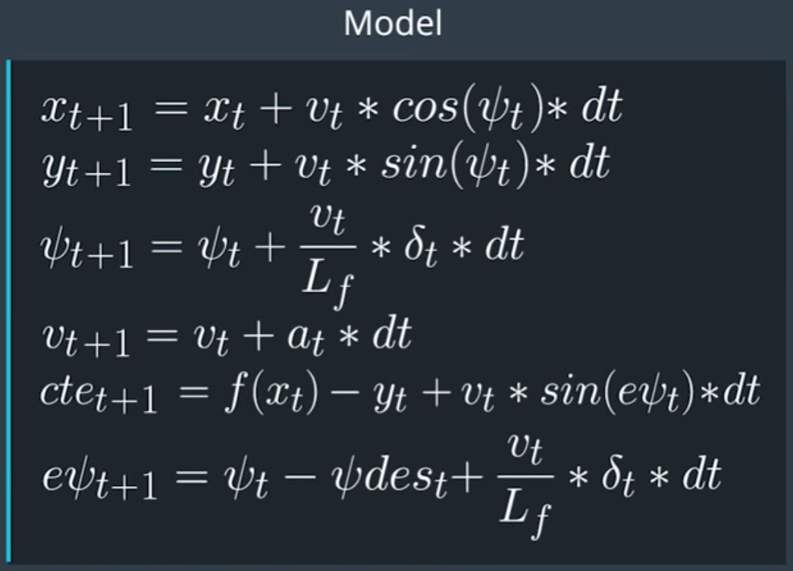
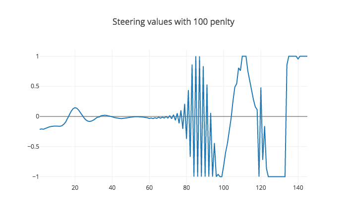
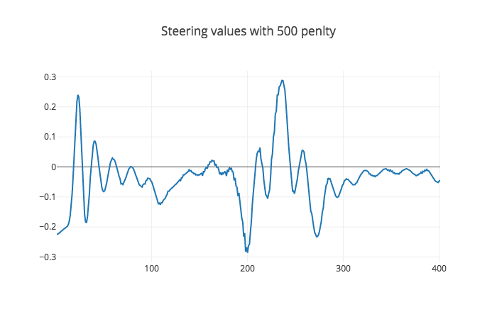
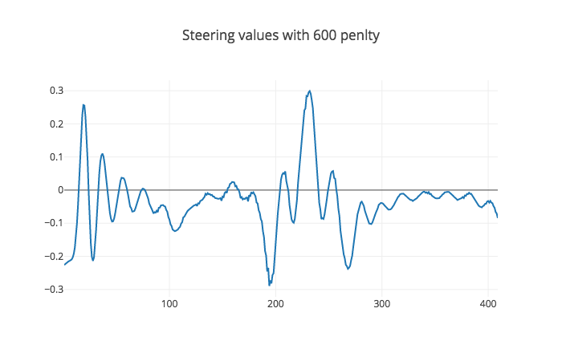
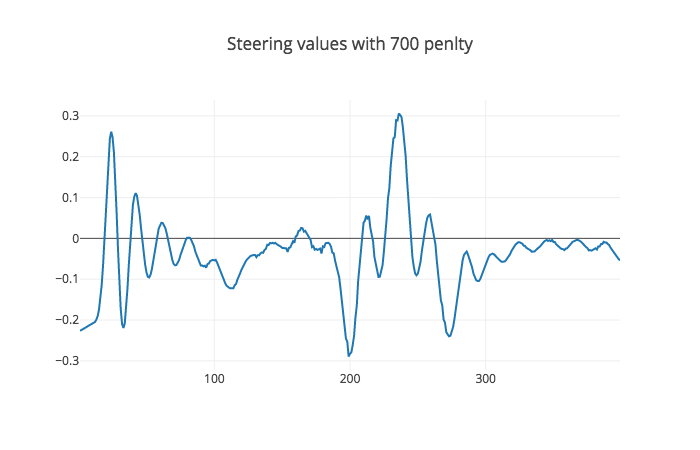
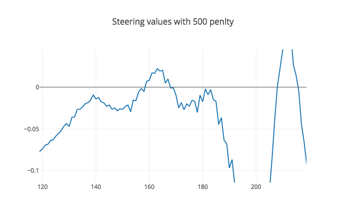
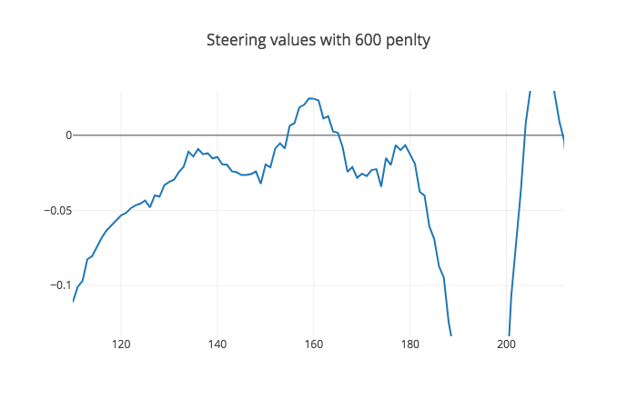
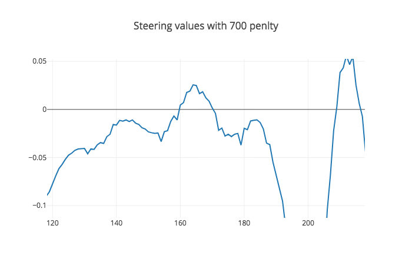

# CarND-MPC
In the is project I try to navigate through the lake track yet another time, but this time I'll be using MPC to guide the vehicle.  MPC deals with the problem of following a trajectory by optimizing the acctuator values to acheive the optimal trajectory, this is different from other contollers such as the PID. MPC will control the steering angel delta δ as well as the acceleration which is controlled by the throttle.

[](https://youtu.be/EnNwPT0BTLc)


## The Model
MPC works on optimizing the error for each N steps of dt duration. I used a simple kinematic bicycle model which accounts for the vehicle heading, but its not a complicated model that accounts for tire friction and others variables. Here is the formula of the model:





It uses the vehicle position `x` and `y`, the heading `Ψ`, velocity `v`, Cross Track Error `cte`, and the heading Error `eΨ`, this model is implemented on line *line `133`* of the [`MPC.cpp`](./src/MPC.cpp) 


## Timestep Length and Elapsed Duration (N & dt)
N and dt or the duration of trajectory So I started where the lecture suggested with **N** to **25** and **dt** to **0.05** I kept decreasing the N value because a high N value gives smoother result, but its computatonally expensive so I wanted the lowest value that could give the optimal result which was **12**; However, I left the dt value at **0.05** which produced really good results and is convienent for latency calculation later.

## Preprocessing and Polynomial Fitting

### Preprocessing
Here I mainly transform all points to vehicle coordinate space using the `toCarCoordinates()` method at line *line `71`* of the [`main.cpp`](./src/main.cpp) because all of our work will be from the vehicle's prespective. First I translate the values around the origin and align the x axis to the heading of the car. 

### Polynomial Fitting
I fit the newly obtained vehicle space waypoints to a 3rd order polynomial using `polyfit()` method at line *line `50`* of the [`main.cpp`](./src/main.cpp), here I used 3 order polynomyal rather than the 1st order that was used in the lectures to have a better curveier fit rather than a linear one because its not a linear model .

## Latency
The project adds a **100 milliseconds ** delay for setting the acctuator values, this counts as **2** steps for the chosen **dt** `2 * 0.005 = 0.1 seconds`. Now we need to account for the delay cause if we use the model as it is we'll  always be a **100 ms** (2 time steps) late which could have catastrophic consiquences in the real world and crash in the simulator at high speeds. So I kept track of previous acctuator values for the duration of the latency which in turn includes it in the optimization and negates the effect of the latency. I had to increase most of the indeices by 2 to account for the latency. 

I added the following variables to the [`MPC.h`](./src/MPC.h)


```   
double prev_a{0};
double prev_delta{0.1};
const int latency_timestep = 2; 
```
and used them to constraint the acctuator values to the previous values to account for latency as you can see at lines * `204` to `216`* of the [`MPC.cpp`](./src/MPC.cpp).

## Tuning 

Here I added a penlty as the Tuning MPC part of the MPC lesson suggested. I used multiple values `[100, 500, 600, 700]` and observed their steering values as you can see in the figures below.

### 100 

Here the car crashed after **146** steps, so I knew I had to do better.
### 500 

Here its a farcry from the previous value and the car drives really well around the track without crashing.However, in the lesson it was said that by increasing the value we can get a smoother result so I kept going.
### 600

And here is the result for the value of **600** smoother than **500**, but not by much so lets go higher.
### 700

This one is a bit better than **600** and 2 bits better than **500** and the car drives even smoother, so I'm going to stop here and hope fully test higher numbers later.

### Conclusion
They all look alike dont they, well all except for 100 which crashed; however, if we look closer we can see that by increasing the value we get a smoother transission as you can see here:

500| 600|700|
---|:--:|:--:
|||

So thats why I stuck with **700** as a correction or smoothening value. I noticed that everytime we increase the value the peak values go a little higher, so as increasing the value is good for smoothening it elongates the peaks in order to get a smoother turn which could be a problem with higher values.


```python

```
